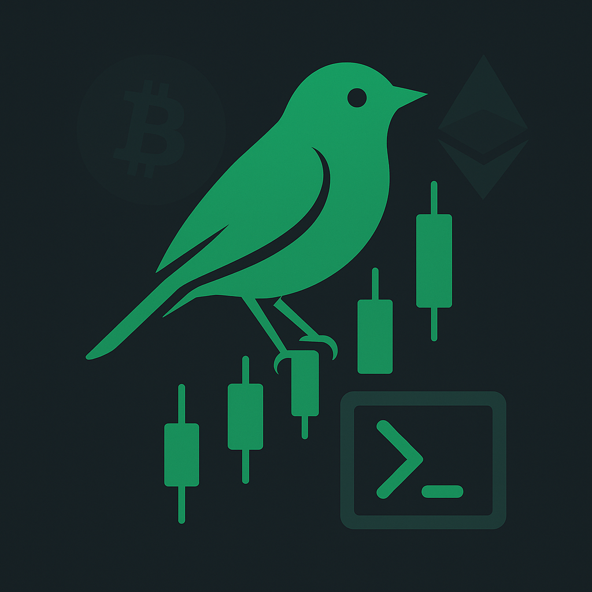

# Robinhood-CryptoTrading

<table width="100%">
  <tr>
    <td align="left">
      
    </td>
    <td align="right" valign="top">
      <a href="https://github.com/masters274/Robinhood-CryptoTrading/blob/main/LICENSE"></a>
    </td>
  </tr>
</table>

## Overview

**Robinhood-CryptoTrading** is a PowerShell module that connects to Robinhood’s Crypto Trading API. It allows you to perform all supported methods/routes such as obtaining account information, retrieving holdings, viewing order details, getting current market quotes, and executing market orders (buy/sell).

> **IMPORTANT:** This project is published under the [MIT License](https://github.com/masters274/Robinhood-CryptoTrading/blob/main/LICENSE). For important legal and liability notices, please read the [DISCLAIMER.md](./DISCLAIMER.md) file.

The module uses BouncyCastle (installed automatically if needed) to handle cryptographic operations (specifically for signing API requests via the Ed25519 algorithm). This dependency is required because Windows does not support Ed25519 natively.

For detailed API reference, check out the [Robinhood Crypto API docs](https://docs.robinhood.com/crypto/trading/). Also, please ensure your API keys are securely stored and, if possible, restricted to specific IP addresses for added security.

## Getting Started

### Prerequisites

- **PowerShell 5.1** or later / PowerShell Core.
- An active Robinhood account with Crypto Trading enabled.
- **BouncyCastle.NetCore** is required for signing API requests. The module will check for this dependency and install it automatically if it is not already present.

### Installation

You can install this module from the PowerShell Gallery:

```powershell
# Navigate to your project directory
Install-Module -Name 'Robinhood-CryptoTrading' -Scope CurrentUser -AcceptLicense

# Import the module
Import-Module -Name 'Robinhood-CryptoTrading'
```

### Setting Up Your API Access

1. **Generate a Key Pair:**
   Use the built-in function to create an Ed25519 key pair.
   ```powershell
   $keyPair = New-RHCKeyPair

   $keyPair.PrivateKey  # Keep this secret
   $keyPair.PublicKey
   ```

2. **Register Your API Keys:**
   Set up your API keys and private key seed:
   - Get your API key from your [Robinhood account](https://robinhood.com/account/crypto), by providing your public key.
   - When saving your credentials, please consider IP restriction for enhanced security.
   ```powershell
   # Save your credentials for use across sessions (for automation)
   Save-RHCCredentials -ApiKey "YOUR_API_KEY" -PrivateKeySeed "YOUR_PRIVATE_KEY_SEED"
   ```

   > **Note:** The credentials are securely stored as encrypted environment variables, but are only accessible by the user account that created them and on the computer where they were saved. These credentials are not portable between computers or user accounts. Saving your API key and Seed will allow you to run the functions without needing to pass the API key and Seed each time. If you do not want to save your API key and Seed, you can pass them in as a parameters to each function that requires it.

3. **Remove Credentials (if needed):**
   You can remove stored API keys using:
   ```powershell
   Remove-RHCCredentials
   ```

## Usage Examples

### Retrieve Your Account Information

```powershell
# Get your account details
$account = Get-RHCAccount
$account | Format-List
```

### View Your Holdings

```powershell
# Get a list of your crypto holdings.
$holdings = Get-RHCHoldings
$holdings | Format-Table
```

> **Note:** Robinhood returns data as JSON containing standard API pagination attributes. When results fit on a single page, both "next" and "previous" will be null.

```powershell
Get-RHCHoldings

next previous results
---- -------- -------
              {@{account_number=1234567890; id=1234567890; instrument_id=1234567890; instrument=...}}


# Capturing the return value, and display the results as an object
$holdings = Get-RHCHoldings

$holdings.results

account_number asset_code total_quantity          quantity_available_for_trading
-------------- ---------- --------------          ------------------------------
1234567890     BTC        0.100000000000000000    0.100000000000000000
```

### Retrieve Orders

```powershell
# Retrieve all orders (or filter by specific criteria using a hashtable)
$orders = Get-RHCOrder -QueryParameters @{ state = "filled" }
$orders.results | Format-Table -AutoSize
```

### Get the Latest Market Data for Bitcoin

```powershell
# Get the best bid and ask quotes for Bitcoin (example: BTC-USD)
$btcQuotes = Get-RHCBestBidAsk -Symbol "BTC-USD"
$btcQuotes.results | Format-List
```

### Place a Market Order (Buy or Sell)

```powershell
# Example: Place a market order to buy Bitcoin (BTC-USD)
New-RHCOrder -Side "buy" -Symbol "BTC-USD" -AssetQuantity "0.001"

# Example: Place a market order to sell Bitcoin (BTC-USD)
New-RHCOrder -Side "sell" -Symbol "BTC-USD" -AssetQuantity "0.001"
```

> **Note:** The examples above do not constitute financial advice. Use these functions at your own risk and always secure your API keys.

## Additional Information

- **BouncyCastle Dependency:**
  The module relies on the BouncyCastle cryptography library to sign API requests. If the library is not found, the module will attempt to install it automatically via NuGet. This provides the necessary security for transaction signing using the Ed25519 algorithm.

- **API Documentation:**
  For more details on available API routes and usage parameters, please refer to the [Robinhood Crypto API docs](https://docs.robinhood.com/crypto/trading/).

## License

This project is licensed under the MIT License. See the [LICENSE](https://github.com/masters274/Robinhood-CryptoTrading/blob/main/LICENSE) file for details.

## Send-Coffee ☕

Automators run on coffee, so if you've found this module useful, consider "Sending a coffee!"

[](https://www.paypal.me/ChrisMasters/5)
